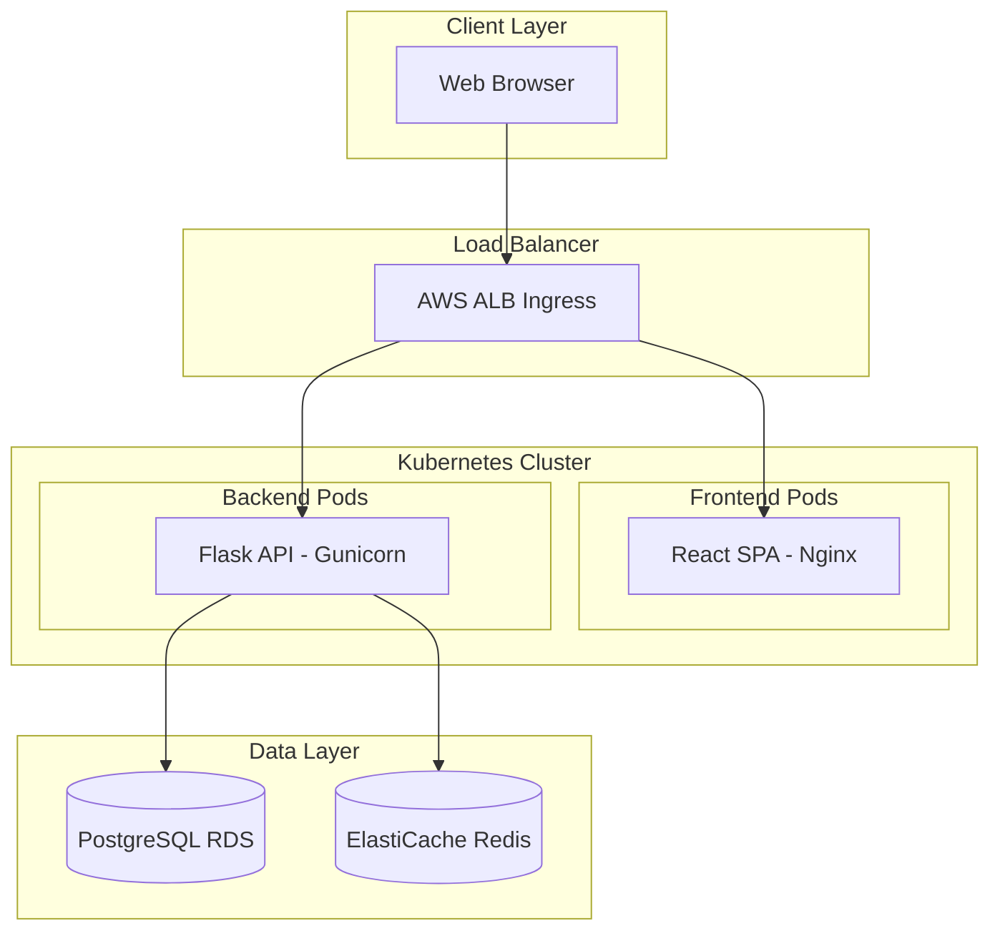

# TaskForge Task Manager Application - Architecture and Roadmap Plan

## Current Architecture Overview

TaskForge is a full-stack task manager deployed on AWS EKS. Here is the high-level architecture:

---

## What Is Implemented

### Backend ([backend/app.py](backend/app.py))

- **Task API**: Full CRUD (create, read, update, delete), batch create, stats
- **Task model**: title, description, completed, priority (1-3), due_date, created_at, updated_at, completed_at, user_id
- **User model**: Stub exists (username, email, password_hash) but **no authentication flow**
- **Stack**: Flask, SQLAlchemy, PostgreSQL, Redis (caching), Flask-Limiter, Prometheus metrics
- **Endpoints**: `/health`, `/ready`, `/api/tasks`, `/api/tasks/<id>`, `/api/tasks/batch`, `/api/stats`
- **Features**: Rate limiting, Redis caching, structured logging, error handlers

### Frontend ([frontend/src/](frontend/src/))

- **Components**: TaskList, TaskForm, TaskStats, TaskFilters
- **Stack**: React 18, Bootstrap, React Router, Axios, React Toastify
- **Features**: Create/edit/delete tasks, toggle complete, filter by completed/priority/search, statistics dashboard
- **API layer**: Axios with Bearer token interceptor (ready for auth, not wired)

### Infrastructure ([infrastructure/main.tf](infrastructure/main.tf))

- **AWS**: VPC, EKS cluster, RDS PostgreSQL 15, ElastiCache Redis 7, ECR, S3, Secrets Manager
- **Kubernetes add-ons**: Load Balancer Controller, EBS CSI, Cluster Autoscaler, Metrics Server
- **Terraform**: Remote state (S3 + DynamoDB lock), environment variables for dev/prod

### Kubernetes ([kubernetes/](kubernetes/))

- Deployments for backend (3 replicas prod) and frontend
- Services, Ingress (ALB), ConfigMaps, Secrets, HPA, PDB
- Canary deployment manifest for backend
- Staging and production namespaces

### CI/CD ([.github/workflows/ci.yml](.github/workflows/ci.yml))

- **Backend**: Lint (flake8, black, mypy), tests (pytest + coverage), PostgreSQL + Redis services
- **Frontend**: Lint, tests (React Testing Library)
- **Security**: Trivy, SonarCloud, Snyk
- **Build**: Docker images pushed to ECR on main/develop
- **No CD**: No automated deployment to EKS; images are built but not deployed

---

## Gaps and Issues

| Area        | Issue                                                                                          | Priority |
| ----------- | ---------------------------------------------------------------------------------------------- | -------- |
| Auth        | User model exists but no login, registration, or JWT flow                                      | High     |
| Redis cache | `redis_client.delete('tasks:*')` does not support wildcards; cache invalidation is ineffective | Medium   |
| CD pipeline | CI builds and pushes images but does not deploy to EKS                                         | High     |
| Frontend    | `package-lock.json` referenced in CI; ensure it exists or use `package.json`                   | Low      |
| Kubernetes  | Ingress routes `/api` to backend service port 80; verify backend Service exposes correct port  | Medium   |
| K8s config  | Placeholder values (`<aws-account-id>`, `cluster-xxx`, etc.) need parameterization             | High     |
| Deprecation | Flask `@app.before_first_request` is deprecated; use `with app.app_context()` at startup       | Low      |

---

## Recommended Roadmap

### Phase 1: Fix Critical Gaps (Pre-Production)

1. **Fix Redis cache invalidation**
  - Replace `redis_client.delete('tasks:*')` with SCAN + DELETE for keys matching `tasks:*`, or maintain a small set of known cache keys and delete those explicitly.
  - Location: [backend/app.py](backend/app.py) around lines 351-354, 404-407, 407-408, 332-333, 378-379.
2. **Parameterize Kubernetes manifests**
  - Use Kustomize, Helm, or envsubst to inject AWS account ID, RDS/Redis endpoints, and image tags.
  - Update [kubernetes/backend-deployment.yaml](kubernetes/backend-deployment.yaml), [kubernetes/configmap.yaml](kubernetes/configmap.yaml), [kubernetes/secrets.yaml](kubernetes/secrets.yaml), and [kubernetes/ingress.yaml](kubernetes/ingress.yaml).
3. **Add CD pipeline**
  - GitHub Action (or Argo CD / Flux) to:
    - Update EKS with new image tags (e.g., `kubectl set image` or Kustomize/Helm).
    - Run after successful build on main for production, develop for staging.

### Phase 2: Authentication

1. **Backend**
  - Add JWT auth: Flask-JWT-Extended or similar.
  - Endpoints: `POST /api/auth/register`, `POST /api/auth/login`, `GET /api/auth/me`.
  - Protect `/api/tasks` routes: require valid JWT; scope tasks by `user_id`.
2. **Frontend**
  - Login/Register pages.
  - Store JWT in `localStorage` or httpOnly cookie; attach via existing Axios interceptor.
  - Redirect unauthenticated users to login.

### Phase 3: Production Hardening

1. **Database migrations**
  - Use Flask-Migrate/Alembic for schema changes; avoid `db.create_all()` in production.
2. **Monitoring**
  - Connect Prometheus metrics to Grafana dashboards.
  - Configure alerts for health check failures, error rates, and latency.
3. **Backup and disaster recovery**
  - Ensure RDS automated backups and retention are configured via Terraform (already present).
  - Document restore procedure.

### Phase 4: Feature Enhancements (Optional)

- Task categories/tags
- Subtasks or checklist items
- Recurring tasks
- Due date reminders (e.g., background job + email/push)
- Multi-tenant or team workspaces

---

## Key File Reference

| Purpose        | Path                                                                     |
| -------------- | ------------------------------------------------------------------------ |
| Backend API    | [backend/app.py](backend/app.py)                                         |
| Frontend entry | [frontend/src/app.js](frontend/src/app.js)                               |
| API client     | [frontend/src/services/api.js](frontend/src/services/api.js)             |
| Infrastructure | [infrastructure/main.tf](infrastructure/main.tf)                         |
| CI/CD          | [.github/workflows/ci.yml](.github/workflows/ci.yml)                     |
| Backend K8s    | [kubernetes/backend-deployment.yaml](kubernetes/backend-deployment.yaml) |
| Ingress        | [kubernetes/ingress.yaml](kubernetes/ingress.yaml)                       |

